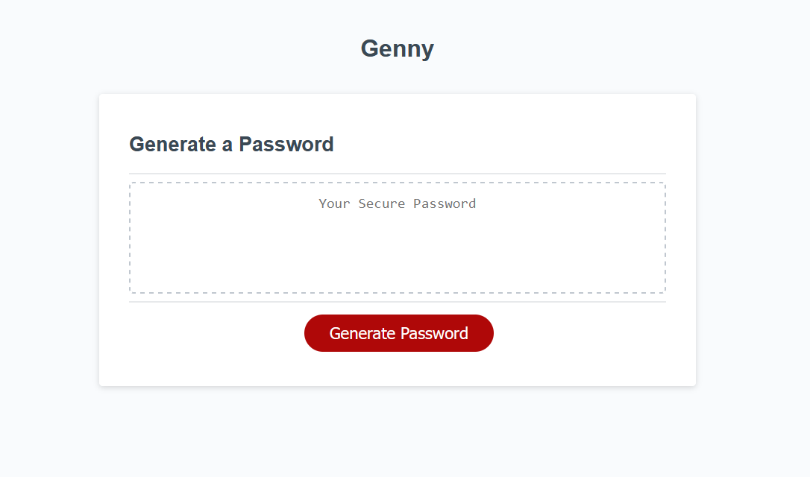

# Genny
Genny is a simple web based password gen using fundamental CSS, HTML, and Javascript for it's functionality and design

## Screenshot

## Usage
The usage of genny is simple.

1. Enter the prompt for password length
2. Click OK if you want to use special characters
3. Done!

## Credits
- Ohio State Bootcamp
- https://stackoverflow.com/questions/62418929/struggling-with-password-generator-in-javascript-wont-correctly-change-text-on